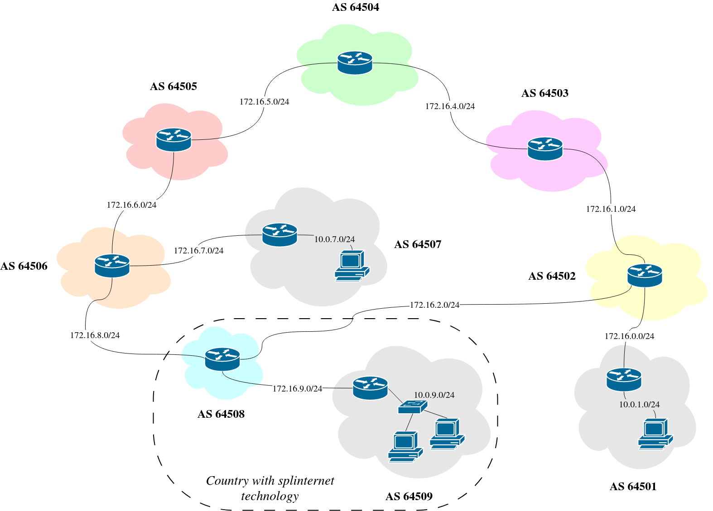

# Toy Internet
Autonomous Systems belonging to different Internet layers interconnected together using the Quagga network routing software suite. This network has to be used under the network emulation system Kathará available at <https://www.kathara.org>.
